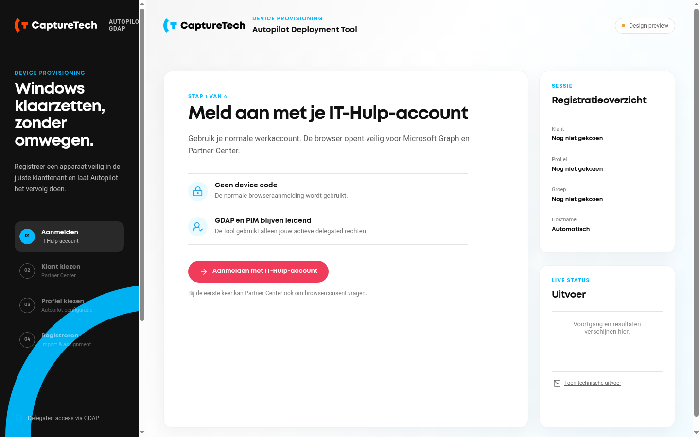
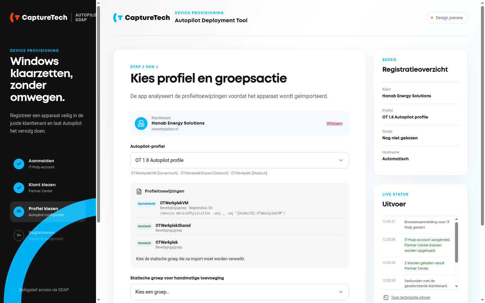
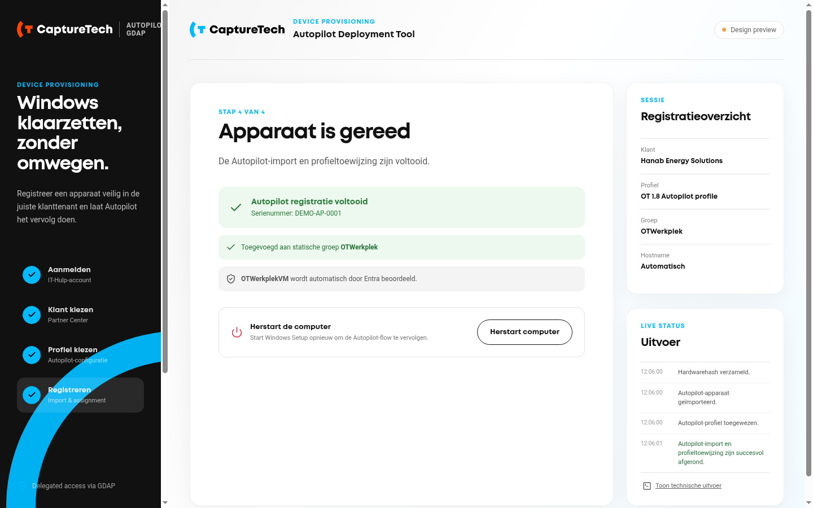

# Autopilot GDAP Tool

[](https://github.com/mvthul/Autopilot-GDAP/actions/workflows/codeql.yml)
[](https://github.com/mvthul/Autopilot-GDAP/actions/workflows/build-tauri.yml)

CaptureTech-toolset voor IT-hulpmedewerkers om Windows Autopilot-apparaten via GDAP en Microsoft Graph aan klanttenants toe te voegen. De moderne Tauri-app is de primaire interface; de WPF-tool blijft beschikbaar als herstel- en diagnosepad.

## Nieuwe CaptureTech desktop-app

Naast de bestaande PowerShell/WPF-tool staat er een moderne, portable Windows-desktop-app in [`tauri-app`](tauri-app). Op een normale Windows-desktop gebruikt deze Windows Web Account Manager (WAM), delegated Graph-rechten en de Autopilot-flow. Tijdens OOBE gebruikt hij bewust browser-SSO als fallback. De app heeft een CaptureTech-interface voor klantselectie, profielkeuze, groepsafhandeling, live voortgang en herstart.

De eerste Tauri-release is bedoeld voor Windows 10/11 x64 en vraagt altijd administratorrechten. De EXE is portable: installatie is niet nodig. Als Windows de EXE toch niet verhoogd start, toont de app een knop **Start opnieuw als administrator**; die opent de normale UAC-bevestiging en start dezelfde EXE opnieuw met een verhoogd token. Windows SmartScreen kan een waarschuwing tonen zolang de EXE niet code-signed is.

Benodigd op het apparaat:

- Windows PowerShell 5.1 of nieuwer;
- Microsoft Edge WebView2 Evergreen Runtime (standaard aanwezig op recente Windows 11-installaties);
- internettoegang naar Microsoft-aanmelding, Microsoft Graph, Partner Center en PSGallery;
- een actief GDAP/PIM-profiel volgens de rechtenmatrix hieronder.

### Lokale ontwikkeling

```powershell
cd .\tauri-app
npm install
npm run tauri dev
```

De browser-preview van `npm run dev` gebruikt veilige voorbeelddata. De werkelijke Microsoft-, Graph- en PowerShell-koppeling is alleen beschikbaar vanuit de gebouwde Tauri-desktopapp.

### Portable EXE publiceren

Een GitHub Actions-workflow bouwt de Windows x64-EXE op een Windows-runner. Publiceer een release door een tag in dit patroon te pushen:

```text
tauri-v0.1.0
```

De workflow voegt `capturetech-autopilot-gdap.exe` én `capturetech-autopilot-gdap.exe.sha256` toe aan de bijbehorende GitHub Release. Controleer de SHA-256 vóór bredere distributie. De huidige `Get-AutopilotGDAP.ps1` blijft beschikbaar als fallback voor OOBE, herstel en diagnose.

### Tauri-interface

De onderstaande screenshots tonen de desktopinterface met veilige voorbeeldgegevens. De gebouwde Windows-app gebruikt dezelfde interface met de echte browser-, Graph- en Partner Center-koppeling.







## Eerste inrichting

De tool gebruikt een eigen multi-tenant App Registration van IT-Hulp. Er worden geen secrets opgeslagen of gepubliceerd.

Voer de setup éénmalig uit op een beheerpc met Azure CLI en Global Administrator-rechten:

```powershell
irm "https://raw.githubusercontent.com/mvthul/Autopilot-GDAP/refs/heads/master/Setup-AutopilotApp.ps1" -OutFile .\Setup-AutopilotApp.ps1
.\Setup-AutopilotApp.ps1 -PartnerTenantId "<PARTNER-TENANT-ID>"
```

Het setupscript maakt een multi-tenant public-client app aan, configureert de delegated Graph-permissies, maakt de Enterprise Application aan en toont ook de Partner Center-consentlink voor de volledige klantenlijst. Er wordt geen client secret aangemaakt.

De tool gebruikt Partner Center `/v1/customers` voor de klantenlijst. Daardoor worden ook klanten zichtbaar die niet in Graph `/contracts` staan, zoals Hanab. Graph wordt daarna gebruikt voor Intune en Autopilot. Graph en Partner Center zijn afzonderlijke resources, maar de Tauri-app vraagt op een normale desktop slechts één keer interactief een WAM-account; de overige tokens worden stil voor hetzelfde account opgehaald.

De Tauri-app bewaart geen eigen refresh-tokenbestand. Tokens en het gekozen account bestaan uitsluitend in de actieve worker; een oude lokale `partnercenter.v1.token`-cache wordt na een succesvolle nieuwe sessie verwijderd. WAM beheert alleen zijn eigen Windows-brokercontext. Device code wordt niet gebruikt. Tijdens OOBE wordt browser-SSO gebruikt omdat WAM daar niet beschikbaar is.

De huidige partner-app-client-id is al ingevuld in `Get-AutopilotGDAP.ps1`. Als je een nieuwe app aanmaakt, vervang je daar de waarde bij `PublicClientId` en publiceer je die versie. De runtime-tool vraagt op andere computers alleen nog om de IT-hulp-login.

### WAM en sessies in de Tauri-app

Op een gewone Windows 10/11-desktop opent stap 1 één native Windows-accountkiezer. De app gebruikt daarna dezelfde gekozen gebruiker stil voor Partner Center en voor iedere geselecteerde klanttenant. Conditional Access, MFA, PIM-activatie, accountwissel of ontbrekende consent kan nog een gerichte native verificatie vragen. Met **Wissel account** wordt alleen de appsessie gewist; Windows-brede WAM-accounts en andere apps worden niet afgemeld.

De public-client appregistratie moet de redirect URI `ms-appx-web://Microsoft.AAD.BrokerPlugin/<CLIENT-ID>` bevatten. `Setup-AutopilotApp.ps1` zet deze naast de localhost-redirects. Voer het setupscript opnieuw uit wanneer een oudere appregistratie deze redirect niet heeft.

Iedere klanttenant moet afzonderlijk admin consent geven. GDAP/PIM blijft vereist; app-consent verleent geen Intune-rol.

## Benodigde rechten

De tool werkt met **delegated permissions**: de app geeft dus nooit zelfstandig toegang. De aangemelde IT-Hulp-gebruiker moet op het moment van uitvoeren via een actieve GDAP/PIM-toewijzing rechten hebben in de geselecteerde klanttenant.

### Eenmalig: partner-tenant en app-inrichting

| Onderdeel | Minimale rol / vereiste | Waarvoor |
| --- | --- | --- |
| Uitvoeren van `Setup-AutopilotApp.ps1` | Global Administrator in de IT-Hulp partner-tenant | Multi-tenant app registreren, delegated permissions configureren en partner-consent geven. |
| Partner Center-klantenlijst | Partner Center-rol die klanten mag bekijken, normaal **Admin agent** | De klantlijst ophalen via Partner Center. |
| Eerste Partner Center-consent | Een account dat Partner Center-consent mag verlenen | Eenmalige browserconsent voor `user_impersonation`; daarna gebruikt iedere technicus zijn eigen lokale, versleutelde token. |

De app vraagt uitsluitend deze delegated Microsoft Graph-scopes aan:

- `DeviceManagementServiceConfig.Read.All`
- `DeviceManagementServiceConfig.ReadWrite.All`
- `Directory.Read.All`
- `Group.Read.All`
- `GroupMember.ReadWrite.All`

### Eenmalig per klanttenant: app autoriseren

De Enterprise Application **CaptureTech Autopilot GDAP** moet in iedere klanttenant bestaan en admin consent hebben voor de bovenstaande Graph-scopes. Hiervoor is een **Global Administrator van de klanttenant** nodig. Dit is noodzakelijk vóór een GDAP-beheerder de app in die klant kan gebruiken; zonder deze stap verschijnt `AADSTS90099`.

In de Tauri-app verschijnt bij een ontbrekende consent direct een gerichte dialoog **Klant-app instellen**. Kies daarin **Klantinstelling starten** om alleen voor de geselecteerde tenant de vaste Microsoft admin-consentpagina te openen. Dit is bewust een browseruitzondering: een Global Administrator van de klanttenant moet die pagina bevestigen. Kies daarna **Opnieuw verbinden**. Ook vóór het verbinden is deze actie beschikbaar onder de geselecteerde klant. Er worden geen device codes gebruikt.

> App-consent vervangt GDAP niet. Het autoriseert de applicatie; de handelingen blijven namens de aangemelde partnergebruiker en diens GDAP-rollen plaatsvinden.

### Tijdens gebruik: IT-Hulp-account / GDAP-PIM in de klanttenant

| Functie in deze tool | Minimale actieve GDAP-rol in de klanttenant |
| --- | --- |
| Autopilot-profielen lezen, apparaat importeren en `-Assign` uitvoeren | **Intune Administrator** |
| Toegewezen groepen, dynamische query’s en nested groepen lezen | **Groups Administrator** |
| Apparaat via `-AddToGroup` aan een statische groep toevoegen | **Groups Administrator** |

Praktisch betekent dit:

1. De GDAP-relatie met de klant moet actief zijn én minimaal **Intune Administrator** en **Groups Administrator** bevatten.
2. Het IT-Hulp-account moet lid zijn van de security group waarop deze GDAP-relatie is gebaseerd.
3. Wanneer die group PIM-managed is, moet de technicus de juiste PIM-activatie vóór stap 2 van de tool uitvoeren.
4. Voor een profiel zonder statische groepsactie is alleen **Intune Administrator** nodig; voor een dynamische groep wordt nooit handmatig membership gewijzigd.

Groepen die niet door Groups Administrator beheerd kunnen worden (bijvoorbeeld role-assignable groups, of groepen waarvoor klantbeleid aanvullende beperkingen oplegt) worden niet automatisch aangepast. Gebruik hiervoor een expliciet geautoriseerde beheerdersroute.

## Gebruik tijdens Windows Setup (OOBE)

1. Druk in OOBE op `Shift + F10`.
2. Start PowerShell.

### Optie A — CaptureTech Tauri-app (aanbevolen)

Deze portable EXE vraagt bij normaal Windows-gebruik automatisch administratorrechten. In OOBE is de PowerShell-sessie doorgaans al verhoogd. Windows 10/11 x64, PowerShell 5.1+ en WebView2 Evergreen zijn vereist.

```powershell
$exe = Join-Path $env:TEMP "CaptureTech-Autopilot-GDAP.exe"
irm "https://github.com/mvthul/Autopilot-GDAP/releases/latest/download/capturetech-autopilot-gdap.exe" -OutFile $exe
Start-Process -FilePath $exe
```

Tijdens OOBE opent de app de normale browser-SSO-aanmelding voor Graph en Partner Center; WAM is daar niet beschikbaar en device code wordt niet gebruikt. Selecteer vervolgens de klant, het profiel en — uitsluitend wanneer nodig — een veilige statische groep.

### Optie B — PowerShell/WPF fallback

Gebruik de fallback wanneer WebView2 ontbreekt, de Tauri-app niet kan starten of voor gerichte diagnose:

```powershell
Set-ExecutionPolicy Bypass -Scope Process -Force
irm "https://raw.githubusercontent.com/mvthul/Autopilot-GDAP/refs/heads/master/Get-AutopilotGDAP.ps1" | iex
```

### Vervolgstappen voor beide opties

1. Meld aan met het IT-Hulp-account.
2. Bevestig bij eerste gebruik de Partner Center-consent als deze nog niet door de partner is verleend. De setup registreert hiervoor de browser-loopbackredirects én de verplichte WAM-brokerredirect.
3. Gebruik het zoekveld boven de klantlijst om bijvoorbeeld `Hanab` te zoeken. De lijst komt uit Partner Center. Elke keuze toont de klantnaam, het primaire tenantdomein en de tenant-ID; dubbele klantnamen zijn daardoor herkenbaar.
4. Selecteer de klanttenant en verbind met de klantcontext.
5. Geef klantconsent wanneer de tool daarom vraagt.
6. Selecteer het Autopilot-profiel en registreer het apparaat. De tool geeft altijd `-Online`, `-TenantId` en `-Assign` door aan de Community-scriptflow.
7. Statische profielgroepen worden via `-AddToGroup` verwerkt; dynamische groepen worden alleen gecontroleerd en nooit handmatig gemuteerd.
8. De herstartknop wordt pas actief na succesvolle import, assignment en een eventuele statische groepsactie.

## Beveiliging

- Geen client secrets, wachtwoorden of tokens in GitHub.
- De Tauri-app bewaart geen eigen refresh-token; de actieve tokencontext verdwijnt bij het sluiten of wisselen van de appsessie.
- Alleen delegated permissions; geen app-only toegang.
- Geen automatische appregistratie of verborgen bootstrap-account.
- PIM/GDAP-rollen worden niet door de tool gewijzigd.
- Zie de volledige [Security Policy](SECURITY.md) voor verantwoord melden, ondersteunde versies en veiligheidsgrenzen.
- CodeQL scant TypeScript en Rust; GitHub Secret Scanning, push protection en Dependabot zijn ingeschakeld.

## Documentatie

De GitHub Wiki-functie is ingeschakeld. De bronpagina's voor installatie en releases, OOBE, GDAP/PIM-rechten en troubleshooting staan in [`docs/wiki`](docs/wiki). GitHub maakt de afzonderlijke wiki-repository pas aan nadat er eenmaal via de [Wiki-pagina](https://github.com/mvthul/Autopilot-GDAP/wiki) een eerste pagina is gemaakt; daarna kunnen deze pagina's direct worden gepubliceerd.
